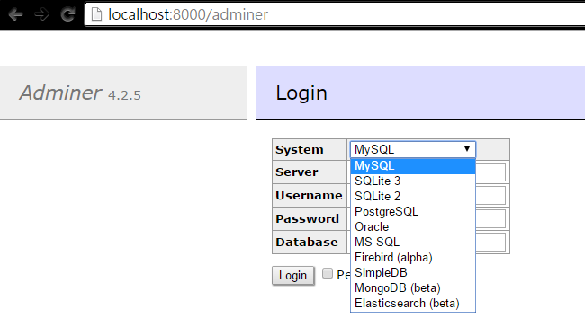

# Laravel Adminer Database Manager

Light weight [Adminer](https://www.adminer.org) database management tool integrated into Laravel 5.

Various database support: MySQL, SQLite, PostgreSQL, Oracle, MS SQL, Firebird, SimpleDB, MongoDB, Elasticsearch, and etc.

## Installation

```
composer require onecentlin/laravel-adminer
```
OR

Update `composer.json` in require section:
```
"require": {
    "onecentlin/laravel-adminer": "~1.0"
},
```

Run:
```
composer update
```

## Prerequisite

Update `config/app.php`

```php
'providers' => [
    ...
    Onecentlin\Adminer\ServiceProvider::class,
];
```

### Disable CSRF

#### Laravel 5.1

Modify `app/Http/Middleware/VerifyCsrfToken.php`, add `adminer` to `$except` array:
```php
protected $except = [
    'adminer'
];
```

### Setup Access Permission

Setup route middleware in `app/Http/Kernel.php`
```php
protected $routeMiddleware = [
    ...
    'adminer' => \App\Http\Middleware\Authenticate::class,
];
```

### Adminer Theme (Optional)

Publish theme file (You may use the default theme without executing this action)
```
artisan vendor:publish --provider="Onecentlin\Adminer\ServiceProvider"
```

You may download `adminer.css` from [Adminer](https://www.adminer.org) or create custom style, and place it into `public` folder.

## Usage
Open URL in web browser
```
http://[your.domain.com]/adminer
```



## Remarks
Due to function name conflicts of Laravel 5 and Adminer, adminer.php file
functions `cookie()`, `redirect()` and `view()` are prefixed with `adm_` prefix.

Inspired by [miroc](https://github.com/miroc/Laravel-Adminer)
